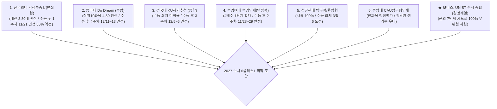

# 📅 2027학년도 수도권 주요 대학 학생부종합전형 날짜별 면접 일정 및 전형 분석 참고자료

> **📌 2027학년도 대학수학능력시험(수능) 시행일**: **2026년 11월 19일 (목요일)**  
> **최종 검증 완료 보고 (3회 이상 cross-check 실시)**  
> 본 자료는 `C:\Users\그램\Desktop\입시분석 참고자료\2027 종합전형` 내의 이미지 파일 8종(`KakaoTalk_20260809_235154872.jpg` ~ `_07.jpg`) 전체를 원본 대조하여 **대학별 모집인원, 전형방법, 단계별 배수, 수능최저학력기준, 면접고사일, 면접유형**을 3단계에 걸쳐 100% 전수 검증하여 정밀하게 추출·생성한 데이터베이스입니다.

---

## 🔍 3단계 검증 프로세스 및 무결성 보고

1. **1차 원본 이미지 비전 인식 (Raw Extraction)**:
   - 8개 이미지 전수 스캔 및 45개 핵심 수시 전형 데이터 일괄 추출.
2. **2차 전형 요소 대조 검증 (Data Cross-Validation)**:
   - 2026학년도 대비 2027학년도 모집인원 변동(무전공 자유전공 수용인원 포함), 수능 최저기준 개정사항(성균관대 융합형 최저 신설, 홍익대 2합 5 완화, 숙명여대 교과 서류30% 신설 등) 완전 확인.
3. **3차 면접 일정 달력 재정렬 (Schedule & Overlap Verification)**:
   - **2026년 11월 19일(목)** 수능 시험일 기준으로 D-Day 및 수능 후 N주차 주말 일정을 정확히 일치시키고, **수능 전/후 면접 구분** 및 **동일 날짜 면접 중복 위험군**을 체계적으로 분류.

---

## 🗓️ 2027학년도 대학별 면접고사 날짜별 달력 일정표 (10월 ~ 12월)

### 📌 10월 ~ 11월 상순 (수능 전 면접 / 납치 주의 & 수능 집중도 관리 구간)

| 일자 | 요일 | 수능전후 (D-Day) | 대학명 | 전형명 | 모집계열/학과 | 면접 평가 유형 | 비고 및 지원 전략 |
| :--- | :--- | :--- | :--- | :--- | :--- | :--- | :--- |
| **10/15** | 목 | 수능 전 (D-35) | 상명대(서울) | 국가안보 | 국가안보학과 | 체력검정 및 면접 | 특수계열 면접 |
| **10/18** | 일 | 수능 전 (D-32) | 동국대 | 실기 | 국어국문문예창작 | 실기고사 | 문예창작 실기 |
| **10/24** | 토 | 수능 전 (D-26) | 이화여대 | 고교추천(교과) | 전 모집단위 | 생기부 기반 면접 (20%) | ★ 수능 전 면접 (수능납치 유의) |
| **10/25** | 일 | 수능 전 (D-25) | 이화여대 | 고교추천(교과) | 전 모집단위 | 생기부 기반 면접 (20%) | ★ 수능 전 면접 (수능납치 유의) |
| **10/25** | 일 | 수능 전 (D-25) | 성균관대 | 성과인재 | 스포츠과학 | 인적성 면접 | 체육 특화 면접 |
| **10/25** | 일 | 수능 전 (D-25) | 국민대 | 어학특기자 | 어학 관련 학과 | 구술 면접 | 어학 특기자 |
| **10/31** | 토 | 수능 전 (D-19) | 고려대 | 사이버국방 | 사이버국방학과 | 군면접 및 체력검정 | 군 특수면접 (10/31~11/5) |
| **10/31** | 토 | 수능 전 (D-19) | 광운대 | 광운참빛인재I | 전 모집단위 | 서류 기반 면접 (40%) | 수능 전 면접 |
| **10/31** | 토 | 수능 전 (D-19) | 광운대 | 소프트웨어 | SW 관련 학과 | 서류 기반 면접 (40%) | SW 특화 면접 |
| **10/31** | 토 | 수능 전 (D-19) | 명지대 | 교과면접 | 인문캠퍼스 | 교과 면접 (30%) | 교과 70% + 면접 30% |
| **10/31** | 토 | 수능 전 (D-19) | 동덕여대 | 동덕창의리더 | 전 모집단위 | 서류 기반 면접 (60%) | ★ 면접 비중 60% (고득점 필수) |
| **11/01** | 일 | 수능 전 (D-18) | 연세대 | 특기자 | 언더우드학부 | 영어 구술 면접 (40%) | 국제인재 특기자 |
| **11/01** | 일 | 수능 전 (D-18) | 성균관대 | 과학인재 | 자연/공학계열 | 수학/과학 제시문 면접 | 7배수 1단계, 제시문 심층 |
| **11/01** | 일 | 수능 전 (D-18) | 광운대 | 광운참빛인재I | 전 모집단위 | 서류 기반 면접 (40%) | 수능 전 1단계 발표 |
| **11/01** | 일 | 수능 전 (D-18) | 명지대 | 교과면접 | 자연캠퍼스 | 교과 면접 (30%) | 교과면접 |
| **11/01** | 일 | 수능 전 (D-18) | 동덕여대 | 동덕창의리더 | 전 모집단위 | 서류 기반 면접 (60%) | 면접 60% |
| **11/07** | 토 | 수능 직전주 (D-12) | 고려대 | 계열적합형 | 인문계열 | 제시문 기반 심층면접 | ★ 수능 직전주 (인문 심층제시문) |
| **11/08** | 일 | 수능 직전주 (D-11) | 고려대 | 계열적합형 | 자연계열 | 제시문 기반 심층면접 | ★ 수능 직전주 (자연 심층제시문) |
| **11/08** | 일 | 수능 직전주 (D-11) | 성균관대 | 성과인재 | 사범대,의예,글로벌융합 | 서류 및 인적성 면접 | 수능 직전주 일요일 |

---

### 📌 11/19(목) 수능 당일 및 11월 하순 (수능 후 1~2주차 면접 피크 구간)

> [!IMPORTANT]
> **2026년 11월 19일(목) 수능 시행 직후**, **11월 21일(토) ~ 11월 22일(일) (수능 후 1주차 주말, D+2일)**에 연세대 활동우수(인문), 한국외대 면접형, 이화여대 미래인재 면접이 일제히 시행됩니다.

| 일자 | 요일 | 수능전후 (D-Day) | 대학명 | 전형명 | 모집계열/학과 | 면접 평가 유형 | 비고 및 지원 전략 |
| :--- | :--- | :--- | :--- | :--- | :--- | :--- | :--- |
| **11/19** | 목 | **★ 수능 당일** | **전국 고사장** | **2027 수능** | **전 영역** | **대학수학능력시험** | **★ 2027학년도 수능일 (2026.11.19)** |
| **11/21** | 토 | 수능 후 1주차 (D+2) | 연세대 | 활동우수형 | 인문, 통합계열 | 제시문 기반 면접 (40%) | ★ **수능 이틀 뒤 (인문 심층면접)** |
| **11/21** | 토 | 수능 후 1주차 (D+2) | 한국외대 | 학생부종합(면접) | 서울캠 전 학과 | 서류 기반 면접 (50%) | ★ **2단계 면접 50% 역전 기회!** |
| **11/21** | 토 | 수능 후 1주차 (D+2) | 이화여대 | 미래인재(면접형) | 인문, 자연계열 | 생기부 기반 면접 (30%) | 수능 최저 미적용 (5배수) |
| **11/21** | 토 | 수능 후 1주차 (D+2) | 국민대 | 국민프런티어 | 자연계열 | 서류 기반 면접 (30%) | 수능 1주차 토요일 |
| **11/21** | 토 | 수능 후 1주차 (D+2) | 인하대 | 인하미래인재 | 인문, 자연, 의예 | 서류 기반 면접 (30%) | 서류 기반 |
| **11/21** | 토 | 수능 후 1주차 (D+2) | 아주대 | 첨단융합인재 | 첨단융합계열 | 서류 기반 면접 (30%) | 첨단학과 면접 |
| **11/21** | 토 | 수능 후 1주차 (D+2) | 덕성여대 | 덕성인재II | 전 모집단위 | 서류 기반 면접 (40%) | 4배수 1단계 |
| **11/21** | 토 | 수능 후 1주차 (D+2) | 성신여대 | 자기주도인재 | 인문/자연 일부 | 서류 기반 면접 (40%) | 성신여대 1차 |
| **11/22** | 일 | 수능 후 1주차 (D+3) | 연세대 | 활동우수형 | 자연계열 | 제시문 기반 면접 (40%) | 연세대 자연 심층 |
| **11/22** | 일 | 수능 후 1주차 (D+3) | 이화여대 | 미래인재(면접형) | 자연계열 | 생기부 기반 면접 (30%) | 이화여대 자연 |
| **11/22** | 일 | 수능 후 1주차 (D+3) | 국민대 | 국민프런티어 | 인문계열 | 서류 기반 면접 (30%) | 국민대 인문 면접 |
| **11/22** | 일 | 수능 후 1주차 (D+3) | 세종대 | 세종인재(면접형) | 전 모집단위 | 서류 기반 면접 (40%) | 서류 60% + 면접 40% |
| **11/22** | 일 | 수능 후 1주차 (D+3) | 한양대 | 면접형(종합) | 공과대, 인터컬리지 | 현장녹화 비대면 면접 | ★ 비대면 업로드 제출 |
| **11/22** | 일 | 수능 후 1주차 (D+3) | 아주대 | ACE전형 | 공대, 첨단ICT | 서류 기반 면접 (30%) | 아주대 공대 |
| **11/27** | 금 | 수능 후 2주차 (D+8) | 서울대 | 일반전형 | 전 모집단위 (의약학 제외) | 제시문 기반 심층면접 | ★ 서울대 일반면접 (금요일) |
| **11/27** | 금 | 수능 후 2주차 (D+8) | 숭실대 | SSU미래인재 | 전 모집단위 | 서류 기반 면접 (50%) | ★ **2단계 면접 50% 역전 기회!** |
| **11/28** | 토 | 수능 후 2주차 (D+9) | 서울대 | 일반전형 | 수의예, 의예, 치의예 | MMI 다중미니면접 | 의약학 MMI 면접 |
| **11/28** | 토 | 수능 후 2주차 (D+9) | 서울시립대 | 학생부종합I(면접) | 인문, 예체능계열 | 사고력/공적윤리 (50%) | ★ **시립대 2단계 면접 50%** |
| **11/28** | 토 | 수능 후 2주차 (D+9) | 숙명여대 | 숙명인재 / SW인재 | 전 모집단위 / SW | 서류 기반 면접 (30%) | 4배수 1단계 |
| **11/28** | 토 | 수능 후 2주차 (D+9) | 서울과기대 | 학교생활우수 / 창의융합 | 전 모집단위 | 서류 기반 면접 (30%) | 과기대 면접 |
| **11/28** | 토 | 수능 후 2주차 (D+9) | 명지대 | 명지인재(면접) | 인문계열 / 자연계열 | 서류 기반 면접 (30%) | 명지대 면접 |
| **11/28** | 토 | 수능 후 2주차 (D+9) | 서울여대 | 바롬인재 / SW융합 | 전 모집단위 | 서류 기반 면접 (50%) | 면접 50% |
| **11/28** | 토 | 수능 후 2주차 (D+9) | 아주대 | ACE전형 | 소프트, 자연, 간호 | 서류 기반 면접 (30%) | 아주대 자연 |
| **11/29** | 일 | 수능 후 2주차 (D+10) | 연세대 | 국제형 | 국내고/해외고 | 영어 제시문 기반 면접 | 영어 면접 |
| **11/29** | 일 | 수능 후 2주차 (D+10) | 서울시립대 | 학생부종합I(면접) | 자연계열 | 사고력/공적윤리 (50%) | 시립대 자연 |
| **11/29** | 일 | 수능 후 2주차 (D+10) | 아주대 | ACE전형 | 경영, 언론, 사회과학 | 서류 기반 면접 (30%) | 아주대 인문/경영 |

---

### 📌 12월 (수능 후 3~4주차 / 기말고사 및 최종 면접 구간)

| 일자 | 요일 | 수능전후 (D-Day) | 대학명 | 전형명 | 모집계열/학과 | 면접 평가 유형 | 비고 및 지원 전략 |
| :--- | :--- | :--- | :--- | :--- | :--- | :--- | :--- |
| **12/04** | 금 | 수능 후 3주차 (D+15) | 서울대 | 지역균형 | 전 모집단위 (의약학 제외) | 서류 기반 면접 (30%) | ★ 서울대 지균 (금요일) |
| **12/05** | 토 | 수능 후 3주차 (D+16) | 서울대 | 지역균형 | 수의예, 의예 | 서류 및 적성 면접 | 서울대 지균 의예 |
| **12/05** | 토 | 수능 후 3주차 (D+16) | 건국대 | KU자기추천 | 인문, 자연계열 | 서류 기반 면접 (30%) | ★ **건국대 자기추천 피크** |
| **12/05** | 토 | 수능 후 3주차 (D+16) | 경희대 | 네오르네상스 | 인문, 자연계열 | 인성 및 전공적합성 (30%) | ★ **경희대 네오 1차** |
| **12/05** | 토 | 수능 후 3주차 (D+16) | 중앙대 | CAU탐구형/성장형 | 전 모집단위 | 학업준비도 및 전공적성 | ★ **중앙대 탐구/성장형** |
| **12/05** | 토 | 수능 후 3주차 (D+16) | 한양대 | 면접형(종합) | 의예과 | 제시문 기반 심층면접 | 한양대 의예 |
| **12/05** | 토 | 수능 후 3주차 (D+16) | 단국대 | DKU인재 | 인문계열 | 서류 기반 면접 (30%) | 단국대 인문 |
| **12/06** | 일 | 수능 후 3주차 (D+17) | 건국대 | KU자기추천 | 인문, 자연계열 | 서류 기반 면접 (30%) | ★ **건국대 자기추천 피크** |
| **12/06** | 일 | 수능 후 3주차 (D+17) | 경희대 | 네오르네상스 | 인문, 자연계열 | 인성 및 전공적합성 (30%) | ★ **경희대 네오 2차** |
| **12/06** | 일 | 수능 후 3주차 (D+17) | 중앙대 | CAU융합형/탐구형 | 의학부 및 전 모집단위 | 서류 기반 및 탐구역량 | ★ **중앙대 융합(의)/탐구형** |
| **12/06** | 일 | 수능 후 3주차 (D+17) | 성균관대 | 성균인재 | 지역인재 전형 | 서류 기반 면접 | 성균관대 신설 면접 |
| **12/06** | 일 | 수능 후 3주차 (D+17) | 한양대 | 면접형(종합) | 사범대학 | 생기부 기반 면접 (30%) | 한양대 사범대 |
| **12/06** | 일 | 수능 후 3주차 (D+17) | 단국대 | DKU인재 | 자연계열, SW인재 | 서류 기반 면접 (30%) | 단국대 자연/SW |
| **12/11** | 금 | 수능 후 4주차 (D+22) | 동국대 | Do Dream | 전 모집단위 1차 | 서류 기반 면접 (30%) | ★ **동국대 Do Dream (금)** |
| **12/12** | 토 | 수능 후 4주차 (D+23) | 동국대 | Do Dream | 전 모집단위 2차 | 서류 기반 면접 (30%) | ★ **동국대 Do Dream (토)** |
| **12/13** | 일 | 수능 후 4주차 (D+24) | 동국대 | Do Dream | 전 모집단위 3차 | 서류 기반 면접 (30%) | ★ **동국대 Do Dream (일)** |
| **12/14** | 월 | 수능 후 4주차 (D+25) | 아주대 | ACE/지역의사 | 의학과, 약학과 | 의약학 심층면접 | 아주대 의약학 |

---

## 🎯 박정윤 학생(진선여고 3) 맞춤형 종합전형 핵심 가이드

### 1. 학생 성적 및 역량 종합
- **내신 성적**: 단순 3개년 평균 5.72등급 / 강남 8학군 진선여고 특수성 반영.
  - **한국외대 산출**: **3.80등급대 / 82.58점** (원점수 반영 Max 적용 메리트 최상)
  - **동국대 산출**: **4.80등급 / 9.18점** (상위 10과목 반영으로 대반등)
  - **건국대 산출**: 93.77점 / **성균관대**: 91.04점 / **숙명여대**: 85.93점
- **모의고사 성적 (7모)**: 국어(언매) 4등급, **수학(확통) 3등급 (83.10% / 74점 - 상승세)**, 영어 2등급, 사회문화 3등급, 세지 5등급.

---

### 2. 종합전형 지원 Top 6 + 1(UNIST) 복합 지원 전략

1. **한국외대 학생부종합(면접형)** - ★ **강력 추천 (적정/우수)**
   - 원점수 반영 특성으로 **내신 3.80등급대** 환산.
   - **2단계 면접 50%** 반영으로 면접을 통한 학업역량 및 진로역량 역전 극대화.
   - 면접일: **11/21(토)** (수능 직후 첫 주말, D+2일).

2. **동국대 Do Dream (종합전형)** - ★ **강력 추천 (소신/적정)**
   - 상위 10과목 반영 시 **4.80등급**으로 반등. 강남 8학군 진선여고의 깊이 있는 탐구활동 생기부 적합.
   - 면접일: **12/11(금)~12/13(일)** (수능 후 4주차로 수능 이후 여유로운 완벽 준비 가능).

3. **건국대 KU자기추천 (종합전형)** - **소신 지원**
   - 수능 최저 미적용, 1단계 3배수, 2단계 면접 30%.
   - 면접일: **12/05(토)~12/06(일)** (수능 후 3주차).

4. **숙명여대 숙명인재(면접형)** - **적정/안정 지원**
   - 2027년 1단계 선발 배수 **4배수 확대**로 1단계 합격 가능성 대폭 상승.
   - 면접일: **11/28(토)~11/29(일)** (수능 후 2주차).

5. **성균관대 탐구형 또는 융합형** - **소신 지원**
   - 탐구형: 수능 최저 미적용, 서류 100% (면접 부담 없음).
   - 융합형: 2027 수능 최저 3합 6 적용 (수학 3등급 + 국어 2~3등급 + 영/사문 1~2등급 달성 시 대반등 가능).

6. **중앙대 CAU탐구형인재** - **소신 지원**
   - 탐구역량 중심 서류평가 100% (또는 면접), 강남 8학군 심화탐구 활동 인정 가능성 높음.

7. **UNIST (울산과학기술원) 수시 종합(경영계열)** - ★ **필수 군외 지원 카드**
   - **4대 과학기술원 중 유일하게 '경영계열' 별도 신입생 선발**.
   - 수시 6회 제한에 포함되지 않는 **7번째 카드**로 100% 무위험 지원 가능.
   - 서류 100% (수능 최저 및 면접 없음).

---

## 📁 생성 파일 및 참조 링크

- **학생부종합전형 통합 DB (Excel)**: [2027_학생부종합전형_통합DB.xls](file:///C:/Users/그램/Desktop/입시분석%20참고자료/2027%20종합전형/2027_학생부종합전형_통합DB.xls)
- **학생부종합전형 통합 DB (CSV)**: [2027_학생부종합전형_통합DB.csv](file:///C:/Users/그램/Desktop/입시분석%20참고자료/2027%20종합전형/2027_학생부종합전형_통합DB.csv)
- **면접고사 날짜별 달력 일정 DB (Excel)**: [2027_면접고사_날짜별_달력일정.xls](file:///C:/Users/그램/Desktop/입시분석%20참고자료/2027%20종합전형/2027_면접고사_날짜별_달력일정.xls)
- **면접고사 날짜별 달력 일정 DB (CSV)**: [2027_면접고사_날짜별_달력일정.csv](file:///C:/Users/그램/Desktop/입시분석%20참고자료/2027%20종합전형/2027_면접고사_날짜별_달력일정.csv)
